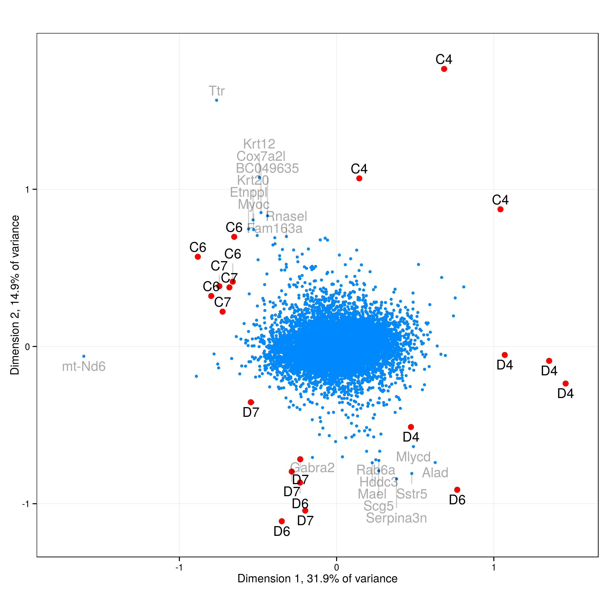
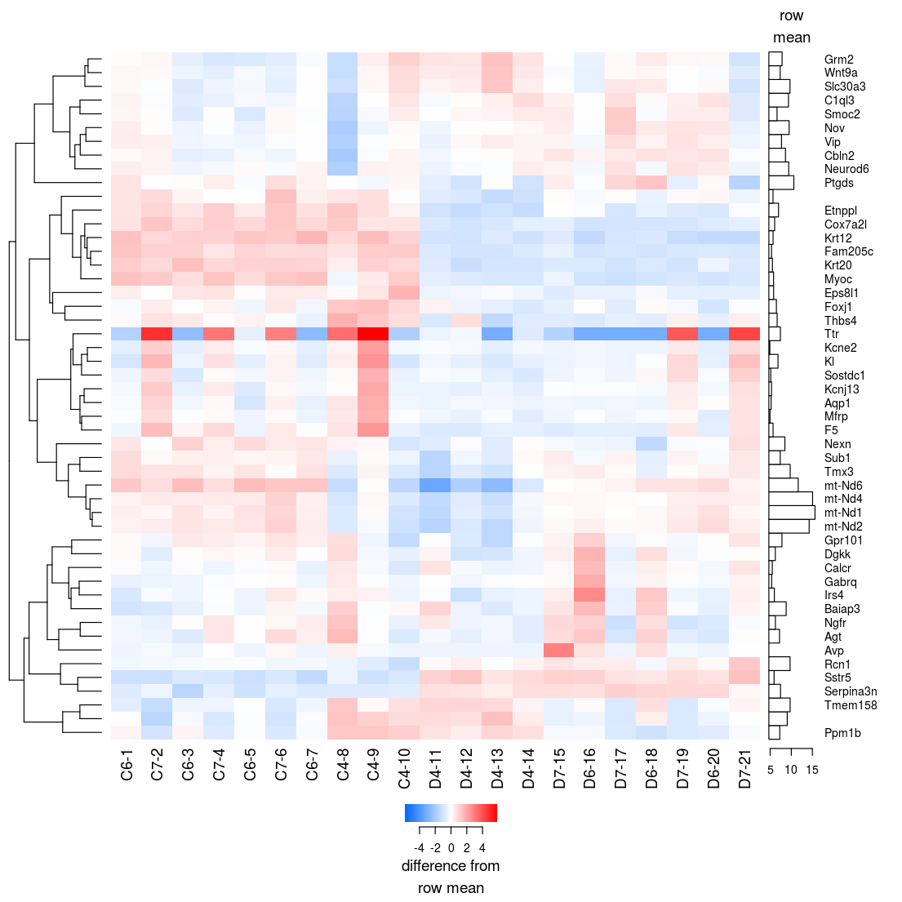

# Varistran

Varistran is an R package providing a Variance Stabilizing Transformation appropriate for RNA-Seq data, and a variety of diagnostic plots based on such transformation.

* [Function reference](http://logarithmic.net/varistran/reference/index.html)

* [Online demo](http://rnasystems.erc.monash.edu:3838/pfh/2015/demo-varistran)

* [A slideshow describing Varistran](http://rnasystems.erc.monash.edu:3838/pfh/2016/varistran/)

* [Poster for ABACBS 2015](doc/varistran-poster-abacbs-2015.pdf) [(on F1000, doi: 10.7490/f1000research.1110757.1)](http://f1000research.com/posters/4-1041)

* [Publication in the Journal of Open Source Software](http://joss.theoj.org/papers/10.21105/joss.00257)

Varistran is developed by Paul Harrison (paul.harrison@monash.edu, [@paulfharrison.bsky.social](https://bsky.app/profile/paulfharrison.bsky.social)) for the [Monash Genomics and Bioinformatics platform](https://www.monash.edu/researchinfrastructure/mgbp).

## Install

Varistran is most easily installed from GitHub using remotes:

```
install.packages("remotes")
remotes::install_github("MonashBioinformaticsPlatform/varistran")
```

### Dependencies

By default, library size estimation is by TMM (Robinson and Oshlack, 2010), implemented in edgeR from BioConductor. You will need to install this manually if you haven't already:

```
install.packages("BiocManager")
BiocManager::install("edgeR")
```

Varistran also uses various CRAN packages, which will be installed automatically using the `remotes::install_github` method above. Refer to the DESCRIPTION file for the full list of dependencies.

## Example usage

I intend to keep adding features to Varistran. Therefore, I recommend using its functions via `varistran::` rather than attaching its namespace with `library(varistran)`.

The examples below use the [Bottomly dataset](http://bowtie-bio.sourceforge.net/recount/ExpressionSets/bottomly_eset.RData) available from [ReCount](http://bowtie-bio.sourceforge.net/recount/).

```
library(Biobase)

download.file("http://bowtie-bio.sourceforge.net/recount/ExpressionSets/bottomly_eset.RData", 
              "bottomly_eset.RData")

load("bottomly_eset.RData")

counts <- exprs(bottomly.eset)

strain <- phenoData(bottomly.eset)$strain
experiment.number <- factor( phenoData(bottomly.eset)$experiment.number )
design <- model.matrix(~ strain + experiment.number)
```

### Variance stabilizing transformation

Say you have a count matrix `counts` and a design matrix `design`. To perform a variance stabilizing transformation:

```
y <- varistran::vst(counts, design=design)
```

By default, Anscombe's (1948) variance stabilizing transformation for the negative binomial distribution is used. This behaves like log2 for large counts (log2 Counts-Per-Million if `cpm=TRUE` is given).

An appropraite dispersion is estimated with the aid of the design matrix. If omitted, this defaults to a column of ones, for blind estimation of the dispersion. This might slightly over-estimate the dispersion. A third possibility is to estimate the dispersion with edgeR.

### Samesum transformation

As of 2025, I am also experimenting with a new transformation method I call "samesum".

* [Documentation](https://logarithmic.net/varistran/reference/samesum_log2_norm.html)
* [Example usage](https://logarithmic.net/varistran/articles/samesum.html)

### Diagnostic plots

`plot_stability` allows assessment of how well the variance has been stabilized. Ideally this will produce a horizontal line, but counts below 5 will always show a drop off in variance.

```
varistran::plot_stability(y, counts, design=design)
```

`plot_biplot` provides a two-dimensional overview of your samples and genes using Principle Components Analysis (similar concept to `plotMDS` in limma):

```
varistran::plot_biplot(y)
```



`plot_heatmap` draws a heatmap.

```
varistran::plot_heatmap(y, n=50)
```




### Shiny report

Varistran's various diagnostic plots are also available as a Shiny app, which can be launched with:

```
varistran::shiny_report(y, counts)
```

If `y` is not given it is calculated with `varistran::vst(counts)`.

```
varistran::shiny_report(counts=counts)
```

* [Online demo](http://rnasystems.erc.monash.edu:3838/pfh/2015/demo-varistran)

This also includes the [limma bioconductor package's](http://bioconductor.org/packages/release/bioc/html/limma.html) `plotMDS` MDS plot (Ritchie et al, 2015).

## Test suite

Download the source code, and ensure that the Bioconductor packages in the "Suggests:" field of the DESCRIPTION file are installed. Then a suite of tests can be run with:

```
make test
```

Outputs are placed in a directory called `test_output`.

Sources of data used in these tests are:

* The [Bottomly dataset](http://bowtie-bio.sourceforge.net/recount/ExpressionSets/bottomly_eset.RData) from [ReCount](http://bowtie-bio.sourceforge.net/recount/) (Frazee, Langmead and Leek, 2011).

* The "arab" dataset provided in the [NBPSeq package](https://cran.rstudio.com/web/packages/NBPSeq/index.html) (Di et al, 2011).

* Simulated data following negative binomial distributions.

Dispersion estimates are compared to those calculated by the [edgeR biocnoductor package's](https://bioconductor.org/packages/release/bioc/html/edgeR.html) `estimateGLMCommonDisp` function (McCarthy, Chen and Smyth, 2012) and by the [DESeq2 bioconductor package's](https://bioconductor.org/packages/release/bioc/html/DESeq2.html) `DESeq` function (Love, Huber and Anders, 2014).


## Supporting/contributing

Please email questions about using this software to the author, <paul.harrison@monash.edu>.

Please file bug reports and feature requests by [filing a bug report](https://github.com/MonashBioinformaticsPlatform/varistran/issues), or by contacting the author.

Pull requests gratefully considered.


## Links

* [Monash Genomics annd Bioinformatics Platform, Monash University](https://www.monash.edu/researchinfrastructure/mgbp)

* [RNA Systems Laboratory, Monash University](http://rnasystems.erc.monash.edu)


## Citing Varistran

To cite this R package, use:

> Harrison, Paul F. 2017. "Varistran: Anscombe's variance stabilizing transformation for RNA-seq gene expression data." *The Journal of Open Source Software* 2 (16). [doi:10.21105/joss.00257](http://dx.doi.org/10.21105/joss.00257)


## References

Anscombe, Francis J. 1948. "The Transformation of Poisson, Binomial and Negative-Binomial Data." *Biometrika* 35 (3/4): 246–54.

Di, Yamming, Daniel W. Schafer, Jason S. Cumbie and Jeff H. Chang. 2011. "The NBP Negative Binomial Model for Assessing Differential Gene Expression from RNA-Seq" *Statistical Applications in Genetics and Molecular Biology* 10 (1). doi:10.2202/1544-6115.1637

Frazee, Alyssa C., Ben Langmead and Jeffrey T. Leek. 2011. "ReCount: A multi-experiment resource of analysis-ready RNA-seq gene count datasets." *BMC Bioinformatics* 12: 449. doi:10.1186/1471-2105-12-449

Love, Michael I., Wolfgang Huber and Simon Anders. 2014. "Moderated estimation of fold change and dispersion for RNA-seq data with DESeq2." *Genome Biology* 15 (12): 550. doi:10.1186/s13059-014-0550-8

McCarthy, Davis J., Yunshun Chen and Gordon K. Smyth. 2012. "Differential expression analysis of multifactor RNA-Seq experiments with respect to biological variation." *Nucleic Acids Research* 40 (10): 4288-4297. doi:10.1093/nar/gks042

Ritchie,  Matthew E., Belinda Phipson, Di Wu, Yifang Hu, Charity W. Law, Wei Shi and Gordon K. Smyth. 2015. "limma powers differential expression analyses for RNA-sequencing and microarray studies." *Nucleic Acids Research* 43 (7): e47. doi:10.1093/nar/gkv007

Robinson, Mark D. and Alicia Oshlack. 2010. "A scaling normalization method for differential expression analysis of RNA-seq data." *Genome Biology* 11 (3): R25. doi:10.1186/gb-2010-11-3-r25


